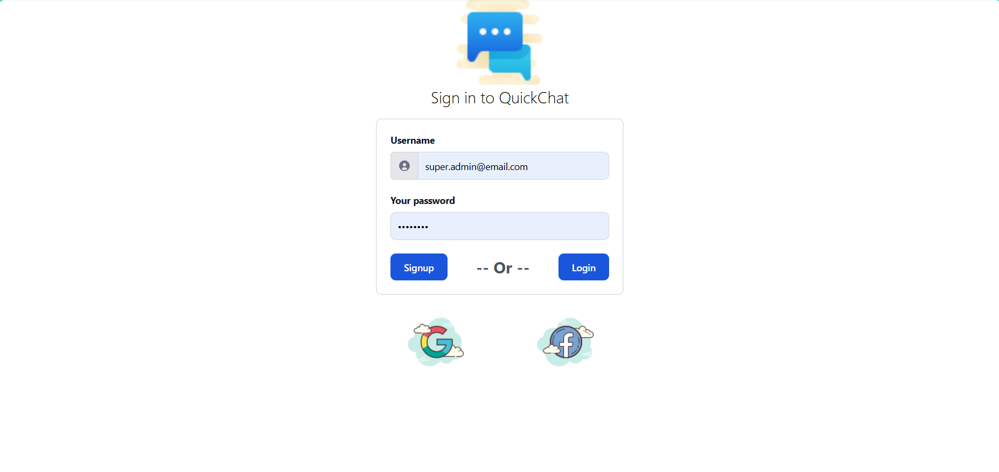
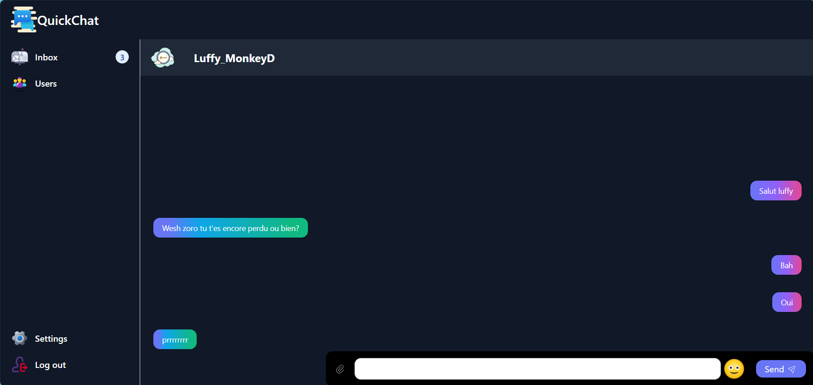

# QuickChat (ChatApp)

### Description 

QuickChat est une application de chat en temps réel conçu pour permettre à deux utilisateurs de communiquer en direct. Le projet utilise **React**, **TypeScript**, et **Vite** pour le front-end, et **Node.js** pour le back-end avec **MongoDB** pour base de donnée.

## Fonctionnalités

- **Authentification des utilisateurs** : Inscription et connexion sécurisées avec authentification basées sur **JWT** et les **cookies**.
- **Chat en temps réel** : Envoyer et recevoir des messages instantanément avec **Socket io**.
- **Interface utilisateur réactive** : Adaptation à toutes les tailles d'écran.
- **Gestion des erreurs** : Validation côté client et serveur.

## Technologies Utilisées

### Front-end
- **React** : Librairie pour construire des interfaces utilisateur.
- **TypeScript** : Superset de JavaScript avec typage statique.
- **Vite** : Outil de développement rapide.


### Back-end
- **Node.js** : Exécution de JavaScript côté serveur.
- **Socket.io** : Communication en temps réel via WebSockets.
- **Express.js** : Framework pour créer une API RESTful.

## Prérequis

- **Node.js** v14 ou supérieur
- **npm** ou **yarn**
- **nodemon**

## Installation

1. Cloner le dépôt :

   ```bash
   git clone https://github.com/ton-utilisateur/chat-app.git
   ```
2. Naviguer dans les dossiers front-end et back-end et installer les dépendances :

    ### Front-end
    ```bash
    cd frontend/my-chat-app
    npm install
    ```

   ### Back-end
    ```bash
    cd backend
    npm install
    ```
## Utilisation 

### Lancer le front-end

Depuis le dossier my-chat-app:
```bash
npm run dev
```

### Lancer le backend

1. Créer un fichier .env et copier le contenu du fichier example.env en y mettant vos propre configuration **MongoDB** ou autre.
2. Depuis le dossier backend:

    ```bash
    npm run start
    ```
## Apercu de la page de connexion



## Apercu de la page de discussion


## Apercu de l'interface de chat




